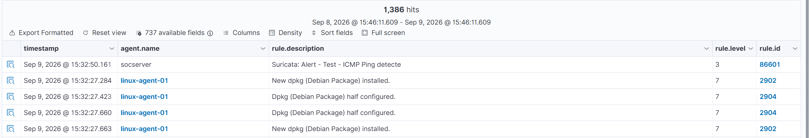
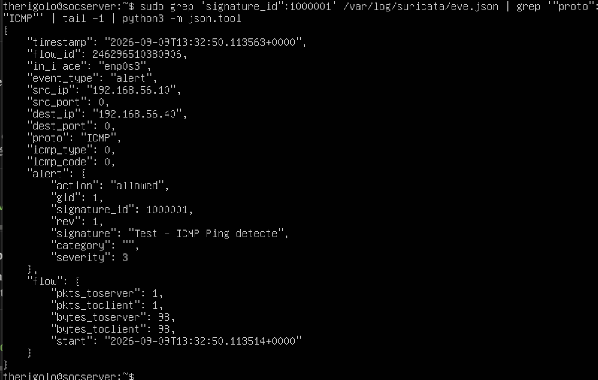

# Journal de bord — Suricata

## Installation et configuration

**Environnement** : Suricata installé sur `wazuh-manager` (192.168.56.10), 
réseau Host-Only.

**Étapes réalisées** :
- Installation de Suricata (`apt install suricata`)
- Mise à jour des règles (`suricata-update`) → 68 563 règles chargées, 
  52 612 activées
- Démarrage et activation du service

## Intégration avec Wazuh

**Config appliquée** : ajout d'un `<localfile>` en format `json` pointant 
vers `/var/log/suricata/eve.json` dans `ossec.conf`, pour que Wazuh lise 
et traite les événements Suricata.

## Test de détection — première tentative (scan Nmap)

**Test réalisé** : scan Nmap (`-sS -A`, puis `-sS -p- -T4`) depuis Kali 
vers `wazuh-manager`. Aucune alerte générée malgré un trafic bien 
capturé par Suricata (confirmé via `eve.json`).

**Diagnostic** : vérification des interfaces réseau (`ip a` sur 
wazuh-manager) ; Suricata écoutait sur `enp0s8` (interface NAT, IP 
10.0.3.15), alors que le trafic de Kali passe par `enp0s3` (interface 
Host-Only, IP 192.168.56.10). Suricata surveillait donc la mauvaise 
interface, ce qui explique l'absence totale d'alerte malgré le scan.

**Résolution** : correction de l'interface dans `suricata.yaml` 
(`enp0s3` au lieu de `enp0s8`), redémarrage du service. Le trafic de 
Kali (192.168.56.40) est alors bien capturé.

**Second point** : même après correction de l'interface, le scan Nmap 
SYN ne déclenchait toujours aucune alerte. Un scan SYN "propre" au 
niveau paquet ne matche pas les signatures par défaut du jeu de règles 
Emerging Threats, principalement orientées détection de payloads ou de 
patterns applicatifs connus, pas la simple présence d'un scan de ports.

## Test de détection — solution : règle custom ICMP

**Config appliquée** : écriture d'une règle de détection personnalisée 
dans `/etc/suricata/rules/local.rules` :

`alert icmp any any -> any any (msg:"Test - ICMP Ping detecte"; sid:1000001; rev:1;)`

**Test réalisé** : `ping -c 4 192.168.56.10` depuis Kali.

**Résultat** : alerte générée avec succès, visible dans `eve.json` 
(signature_id 1000001), puis confirmée dans le Dashboard Wazuh 
(Security events) sous la forme `Suricata: Alert - Test - ICMP Ping 
detecte` (rule.id 86601) ; preuve que la chaîne complète IDS (Suricata) 
→ SIEM (Wazuh) fonctionne de bout en bout.

## Ce que j'en retiens

- Toujours vérifier quelle interface réseau est réellement surveillée 
  avant de chercher une erreur ailleurs ; `ip a` doit être le premier 
  réflexe de diagnostic sur ce type de problème.
- Un jeu de règles standard ne détecte pas tout : un scan discret peut 
  passer inaperçu face à des signatures génériques. Écrire ses propres 
  règles permet de cibler précisément ce qu'on veut détecter, plutôt 
  que de dépendre uniquement de signatures toutes faites.
- Suricata et Wazuh ont des rôles complémentaires : Suricata inspecte 
  le trafic réseau brut et détecte des signatures, Wazuh centralise et 
  affiche ces alertes aux côtés des événements hôtes (logs, FIM...) ;
  c'est cette combinaison réseau + hôte qui donne une vraie visibilité 
  de type SOC.

