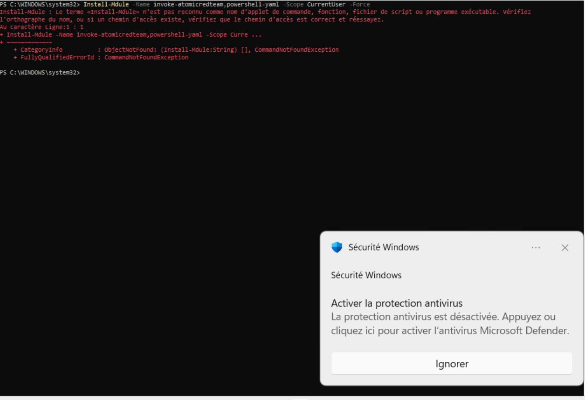
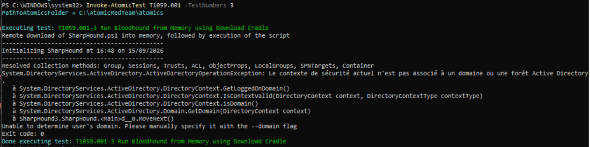
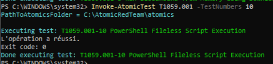
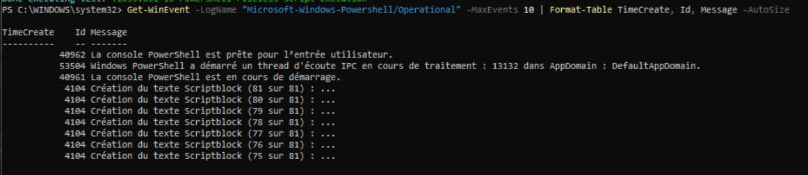
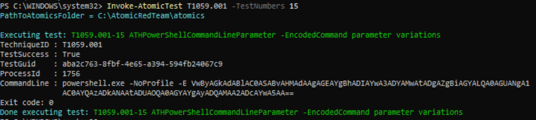
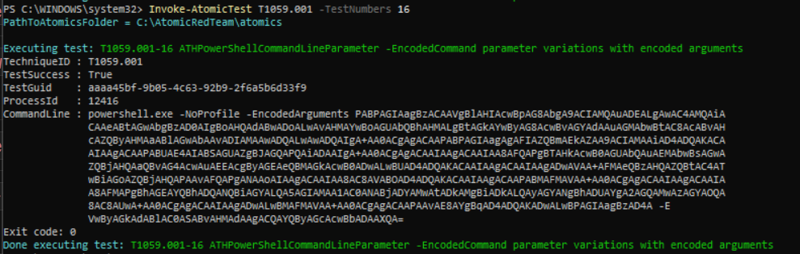

# Simulation d'attaques — Atomic Red Team 

## Contexte

Cette partie vise à simuler des techniques d'attaque réelles (référentiel 
MITRE ATT&CK) via l'outil Atomic Red Team, sur l'agent `windows-agent-02`, 
afin de vérifier la capacité de détection du SOC mis en place dans les 
parties précédentes.

## Installation

**Étapes réalisées** :
```powershell
Set-ExecutionPolicy -Scope CurrentUser -ExecutionPolicy Bypass -Force
Install-Module -Name invoke-atomicredteam,powershell-yaml -Scope CurrentUser -Force
Import-Module invoke-atomicredteam -Force
Install-AtomicRedTeam -getAtomics
```

**Problème rencontré** : Windows Defender a bloqué la lecture des fichiers 
de définition des techniques (`Get-Content : Impossible de terminer 
l'opération, car le fichier contient un virus ou un logiciel 
potentiellement indésirable`), empêchant tout test de s'exécuter.

**Diagnostic** : comportement attendu ; les fichiers Atomic Red Team 
contiennent de vrais patterns d'attaque, qu'un antivirus détecte 
normalement comme suspects.

**Résolution** :
1. Exclusion du dossier `C:\AtomicRedTeam` via les paramètres de sécurité 
   Windows (interface graphique, la commande `Add-MpPreference` seule 
   n'a pas suffi)
2. Désactivation temporaire de la Protection contre les modifications 
   (Tamper Protection) et de la protection en temps réel
3. Réinstallation forcée : `Install-AtomicRedTeam -getAtomics -Force`



**Ce que j'en retiens** : un antivirus bloque ce type d'outil par design, 
avant même qu'un SIEM n'ait à intervenir ; c'est un premier niveau de 
défense à documenter en soi.

---

## Tableau de couverture MITRE ATT&CK

| # | Tactique | Technique | Détectée ? | Résultat résumé |
|---|---|---|---|---|
| 1 | Credential Access | T1110 — Brute Force (SSH) | ✅ | Règle custom 100010, niveau 10 |
| 2 | Credential Access | T1059.001-1 — Mimikatz | ❌ | Bloqué par LSA Protection Windows |
| 3 | Discovery / Credential Access | T1059.001-3 — Bloodhound (Memory) | ❌ | Prérequis Active Directory manquant |
| 4 | Execution | T1059.001-10 — PowerShell Fileless Script | ❌ | Exécuté mais non détecté par Wazuh |
| 5 | Execution | T1059.001-15 — PowerShell Encoded Command | ✅ | Règles 91809/91810 + reconnaissance |
| 6 | Execution | T1059.001-16 — PowerShell Encoded Arguments | ✅ | Même détection, confirme la robustesse |
| 7 | Discovery | T1082 / T1057 / T1518.001 (manuel) | ❌ | Commandes légitimes, pas de signature |

---

## Détail par test

### 1. T1110 — Brute Force SSH (Credential Access)

*(Réutilisation du travail des parties précédentes ; technique déjà simulée 
et détectée avant l'introduction d'Atomic Red Team)*

**Hypothèse** : plusieurs échecs d'authentification SSH rapprochés 
depuis la même IP doivent déclencher une alerte de corrélation.

**Test réalisé** : 4 tentatives de connexion SSH échouées depuis Kali 
vers `linux-agent-01` en moins de 2 minutes.

**Résultat** : alerte déclenchée par la règle custom **100010** 
(niveau 10), basée sur la règle native 5760, avec mapping MITRE T1110.


---

### 2. T1059.001-1 — Mimikatz (Credential Access)

**Hypothèse** : l'exécution de Mimikatz devrait permettre le dump des 
identifiants en mémoire (LSASS), potentiellement détecté par Wazuh.

**Vérification des prérequis** :
```powershell
Invoke-AtomicTest T1059.001 -TestNumbers X -GetPrereqs
```
**Commande exécutée** :
```powershell
Invoke-AtomicTest T1059.001 -TestNumbers 1
```

**Résultat observé** : Mimikatz s'exécute, mais la commande 
`sekurlsa::logonpasswords` échoue avec une erreur d'accès refusé 
(code `0x00000005`), empêchant tout dump réel de credentials.

**Analyse** : l'échec est probablement dû à la LSA Protection 
(`RunAsPPL`) de Windows, qui bloque l'accès en lecture à la mémoire de 
LSASS, indépendamment de Windows Defender. Un premier essai avait 
généré un événement Defender (ID 1116, détection du fichier lui-même), 
mais ce n'est pas la même chose que le blocage de l'accès mémoire.

**Détection Wazuh** : ❌ non détectée. Recherche effectuée dans le 
canal Defender Operational (rien de pertinent) et dans Discover sur la 
plage horaire du test (rien de significatif).

**Ce que j'en retiens** : ce test illustre qu'un Windows moderne 
dispose de protections natives contre le credential dumping, 
indépendamment du SIEM ; une vraie chaîne de défense combine ces 
protections système avec la détection du SIEM.


---

### 3. T1059.001-3 — Bloodhound from Memory (Discovery / Credential Access)

**Hypothèse** : la collecte de données Active Directory via BloodHound 
devrait être détectable comme reconnaissance suspecte.

**Commande exécutée** :
```powershell
Invoke-AtomicTest T1059.001 -TestNumbers 3
```

**Résultat observé** : échec avec `ActiveDirectoryOperationException` ;
*"Le contexte de sécurité actuel n'est pas associé à un domaine ou une 
forêt Active Directory"*.

**Analyse** : ce test nécessite un environnement joint à un domaine 
Active Directory, absent de ce lab (poste Windows autonome, pas de 
contrôleur de domaine).

**Détection Wazuh** : non applicable ; rien ne s'est réellement exécuté.

**Ce que j'en retiens** : certaines techniques de reconnaissance AD ne 
peuvent pas être simulées dans un lab à un seul poste Windows isolé. 
Une extension possible du lab serait l'ajout d'un contrôleur de domaine.



 

---

### 4. T1059.001-10 — PowerShell Fileless Script Execution (Execution)

**Hypothèse** : l'exécution d'un script PowerShell « fileless » (sans 
écriture sur disque) devrait être visible via le Script Block Logging 
Windows, et remonter dans Wazuh si le canal correspondant est collecté.

**Commande exécutée** :
```powershell
Invoke-AtomicTest T1059.001 -TestNumbers 10
```

**Résultat observé** : exécution réussie côté Windows, confirmée par 
la présence d'événements **Event ID 4104** (Script Block Logging) via :
```powershell
Get-WinEvent -LogName "Microsoft-Windows-PowerShell/Operational" -MaxEvents 10
```

**Config vérifiée côté Wazuh** :
- Ajout du canal `Microsoft-Windows-PowerShell/Operational` dans 
  `agent.conf` (groupe `default`, côté manager)
- Synchronisation confirmée (le bloc apparaît bien dans la copie locale 
  `C:\Program Files (x86)\ossec-agent\shared\agent.conf`)
- Groupe de l'agent vérifié (`default`, correct)

**Résultat Wazuh** : ❌ non détectée, malgré une chaîne de collecte 
vérifiée à tous les niveaux accessibles.

**Analyse** : cause exacte non identifiée avec certitude dans le temps 
imparti. Pistes possibles : délai de collecte plus long que prévu, 
volume d'événements PowerShell noyant l'événement recherché, ou 
nécessité d'un decoder Wazuh dédié à ce canal spécifique non présent 
par défaut.

**Ce que j'en retiens** : la configuration d'un SIEM n'est pas toujours 
suffisante en apparence pour garantir une collecte effective. Un 
résultat "non détecté" persistant malgré une config apparemment 
correcte est en soi une information utile, et savoir arbitrer le temps 
investi sur un problème plutôt que de bloquer indéfiniment dessus est 
une compétence à part entière.





---

### 5-6. T1059.001-15/16 — PowerShell Encoded Command / Encoded Arguments (Execution)

**Hypothèse** : une commande PowerShell encodée en Base64 (technique 
d'évasion classique) devrait être détectée par une règle Wazuh dédiée 
à l'analyse comportementale PowerShell.

**Commandes exécutées** :
```powershell
Invoke-AtomicTest T1059.001 -TestNumbers 15
Invoke-AtomicTest T1059.001 -TestNumbers 16
```

**Résultat observé** : détection riche et immédiate côté Wazuh sur les 
deux variantes, avec plusieurs règles déclenchées simultanément :
- `91809` (niveau 10) — détection de l'encodage Base64
- `91810` (niveau 10) — détection d'utilisation suspecte de l'API 
  CreateThread (technique d'injection mémoire)
- `91815` (niveau 4) — reconnaissance de processus
- `91816` (niveau 4) — requête de variables d'environnement système
- `91819` (niveau 4) — recherche dans le système de fichiers
- `91826` (niveau 4) — exécution de `Copy-Item`
- `91837` (niveau 4) — `Get-Content -Stream`/`Invoke-Expression`, 
  possible exécution de chaîne comme code
- `91842` (niveau 4) — `Get-Item -Path`, tentative de lecture de fichiers
- `91808` (niveau 3) — requête de valeur de registre

**Analyse** : contrairement aux tests 1, 3 et 10 sur la même technique 
de base, ces sous-tests déclenchent un jeu de règles Wazuh riche et 
spécifique à l'analyse comportementale PowerShell ; probablement basé 
sur l'analyse de la ligne de commande complète du processus (proche 
d'un Event ID 4688 avec ligne de commande) plutôt que sur le seul canal 
PowerShell Operational testé en test 10.

**Ce que j'en retiens** : tester plusieurs variantes d'une même 
technique permet de vérifier la robustesse d'une détection ; une règle 
qui ne matche qu'une syntaxe précise serait facilement contournable par 
un attaquant changeant légèrement sa méthode d'encodage. Ici, la 
détection reste cohérente sur les deux variantes testées, ce qui est 
un bon signe de robustesse.



.png)
.png)




---

### 7. T1082 / T1057 / T1518.001 — Discovery (tests manuels)

**Hypothèse** : des commandes de reconnaissance système (information 
système, processus en cours, état de l'antivirus) pourraient être 
repérées comme comportement de reconnaissance par Wazuh.

**Commandes exécutées** (manuellement, sans Atomic Red Team, pour 
éviter une dépendance d'installation supplémentaire) :
```powershell
systeminfo
whoami /all
Get-Process
Get-MpComputerStatus
```

**Résultat observé** : aucune alerte générée côté Wazuh.

**Analyse** : ces commandes sont des opérations système légitimes et 
courantes (usage admin normal), sans caractéristique suspecte 
(pas d'encodage, pas d'appel API bas niveau). Le jeu de règles Wazuh 
observé sur les tests précédents cible spécifiquement des patterns 
d'obfuscation ou de comportement malveillant, pas l'exécution de 
commandes de reconnaissance basiques ; ce qui est cohérent avec une 
détection bien calibrée : logger toute commande système produirait un 
volume ingérable de faux positifs.

**Ce que j'en retiens** : la reconnaissance (Discovery) est une des 
tactiques MITRE les plus difficiles à détecter par signature, car les 
commandes utilisées sont aussi celles d'un usage normal. Une vraie 
détection nécessiterait plutôt une analyse comportementale (volume 
inhabituel de commandes de reconnaissance en peu de temps, horaire 
inhabituel, utilisateur non-admin qui lance ces commandes...) plutôt 
qu'une simple règle de mot-clé.


---

## Ce que j'en retiens 

Cette phase de simulation a permis de mettre en évidence plusieurs 
réalités concrètes d'un environnement de détection :

- Une bonne détection dépend fortement de la source de log collectée : 
  le même type d'action (exécution PowerShell) peut être détecté ou 
  non selon qu'on collecte le canal PowerShell Operational seul, ou 
  qu'on bénéficie d'une analyse plus poussée de la ligne de commande.
- Des protections système natives (LSA Protection, Windows Defender) 
  peuvent bloquer une attaque avant même que le SIEM n'ait à intervenir 
  ; la sécurité n'est jamais l'affaire d'un seul outil.
- Toutes les techniques ne sont pas testables dans un lab de taille 
  limitée (dépendance à un domaine Active Directory notamment).
- La détection de reconnaissance (Discovery) est intrinsèquement 
  difficile par signature, car les commandes utilisées sont aussi 
  celles d'un usage légitime.
- Un tableau de couverture avec des résultats mixtes (détecté/non 
  détecté, chacun expliqué) est plus représentatif d'un vrai exercice 
  de test de détection qu'un tableau où tout serait vert 
  artificiellement.
