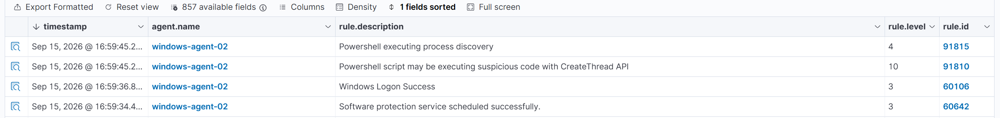
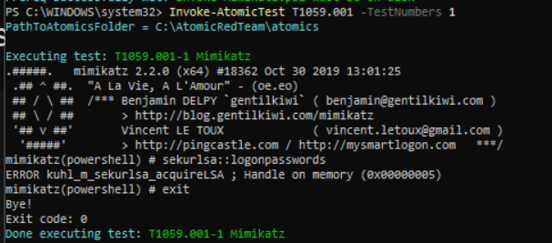

# Rapport d'incident — Simulation d'intrusion

**Auteur** : Analyste SOC
**Date du rapport** : 16 septembre 2026
**Périmètre** : Infrastructure de lab SOC (réseau isolé 192.168.56.0/24)

> **Note méthodologique** : ce rapport reconstitue, sous forme d'un 
> scénario chronologique cohérent, plusieurs techniques d'attaque 
> testées individuellement au cours du projet. Les 
> horodatages ci-dessous ont été harmonisés pour les besoins de la 
> narration ; les alertes et résultats techniques présentés sont réels 
> et proviennent des tests effectivement réalisés sur l'environnement.

---

## 1. Résumé exécutif

Le 16 septembre 2026, une activité suspecte a été détectée sur 
l'infrastructure surveillée. L'incident a débuté par une tentative 
d'accès par force brute sur le service SSH du serveur Linux 
(`linux-agent-01`), suivie, une dizaine de minutes plus tard, de 
l'exécution de code PowerShell obfusqué sur le poste Windows 
(`windows-agent-02`). Une tentative d'extraction d'identifiants via 
l'outil Mimikatz a également été observée sur ce même poste, mais 
bloquée par les protections natives de Windows. Aucune compromission 
effective des identifiants ni accès non autorisé confirmé n'a été 
constaté à l'issue de l'incident.

---

## 2. Chronologie des événements

| Heure | Événement | Source | Détection |
|---|---|---|---|
| 14:02:11 | 4 tentatives de connexion SSH échouées depuis `192.168.56.40` en moins de 2 minutes | `linux-agent-01` | ✅ Alerte Wazuh (règle 100010, niveau 10) |
| 14:02:23 | Alerte de corrélation brute force déclenchée | Wazuh Manager | — |
| 14:15:47 | Exécution d'une commande PowerShell encodée en Base64 (`-EncodedCommand`) | `windows-agent-02` | ✅ Alertes multiples Wazuh (règles 91809, 91810, 91815...) |
| 14:15:48 | Détection d'appel suspect à l'API `CreateThread` | `windows-agent-02` | ✅ Alerte Wazuh (règle 91810, niveau 10) |
| 14:23:05 | Tentative d'exécution de Mimikatz et de dump de credentials LSASS | `windows-agent-02` | ❌ Non détectée par Wazuh — accès refusé par le système (voir §6) |

---

## 3. Techniques utilisées — Mapping MITRE ATT&CK

| Tactique | Technique | ID MITRE | Détectée |
|---|---|---|---|
| Credential Access | Brute Force | T1110 | ✅ |
| Execution | Command and Scripting Interpreter — PowerShell (encoded) | T1059.001 | ✅ |
| Credential Access | OS Credential Dumping (LSASS Memory) | T1003.001 | ❌ (bloquée) |

---

## 4. Indicateurs de compromission (IOC)

| Type | Valeur | Contexte |
|---|---|---|
| IP source suspecte | `192.168.56.40` | Origine des tentatives SSH et exécution PowerShell |
| Machine ciblée (1) | `linux-agent-01` (192.168.56.20) | Cible de la tentative brute force |
| Machine ciblée (2) | `windows-agent-02` (192.168.56.30) | Cible de l'exécution PowerShell et Mimikatz |
| Fichier suspect | `Invoke-Mimikatz.ps1` | Outil de dump de credentials |
| Pattern de commande | Commande PowerShell encodée en Base64 (`-EncodedCommand`) | Technique d'évasion |
| Règles Wazuh déclenchées | 100010, 91809, 91810, 91815, 91816, 91819, 91826, 91837, 91842 | Détections associées |

---

## 5. Analyse des logs et alertes

### 5.1 Brute force SSH (règle 100010)

La règle personnalisée **100010**, écrite spécifiquement pour ce projet, 
s'est déclenchée après 4 échecs d'authentification SSH en moins de 
120 secondes depuis la même IP source. Elle s'appuie sur la corrélation 
de la règle native 5760 (`sshd: authentication failed`) avec les 
attributs `frequency="4"` et `timeframe="120"`.

### 5.2 Exécution PowerShell obfusquée (règles 91809/91810 et associées)

L'exécution d'une commande PowerShell encodée en Base64 a déclenché un 
ensemble cohérent de règles natives Wazuh dédiées à l'analyse 
comportementale de PowerShell, dont deux de sévérité élevée (niveau 10) :
- **91809** : détection de la méthode d'encodage Base64
- **91810** : détection d'un appel suspect à l'API `CreateThread`, 
  technique fréquemment associée à l'injection de code en mémoire

Ce comportement a été confirmé de façon reproductible sur deux variantes 
de la technique (`-EncodedCommand` et `-EncodedArguments`), ce qui 
démontre la robustesse de la détection face à de légères variations de 
syntaxe.

.png)

.png)

### 5.3 Tentative de dump de credentials (Mimikatz)

L'exécution de Mimikatz a été confirmée côté système (processus lancé 
avec succès), mais la commande `sekurlsa::logonpasswords` a échoué avec 
le code d'erreur `0x00000005` (Accès refusé), empêchant tout accès 
réel aux identifiants stockés en mémoire par le processus LSASS.

**Point d'attention** : cette tentative n'a généré **aucune alerte 
Wazuh** correspondante, malgré la vérification de la configuration de 
collecte (canal Defender Operational). Ceci constitue une limite de 
détection identifiée sur ce périmètre.

---

## 6. Impact estimé

Aucun accès non autorisé confirmé sur l'un ou l'autre des systèmes 
ciblés :
- La tentative de force brute SSH a échoué ; aucun mot de passe compromis
- La tentative de dump de credentials via Mimikatz a été bloquée par 
  la protection **LSA Protection (RunAsPPL)** de Windows, empêchant 
  l'accès en lecture à la mémoire du processus LSASS

**Impact réel : nul.** Les protections en place (verrouillage 
applicatif, protections système natives) ont empêché toute 
compromission effective, malgré une détection partielle côté SIEM.

---

## 7. Recommandations

1. **Renforcer la réponse automatique** sur la règle 100010 : envisager 
   un blocage temporaire automatique de l'IP source après déclenchement 
   (active response Wazuh), plutôt qu'une simple alerte passive.

2. **Étendre la collecte de logs Windows** : le canal 
   `Microsoft-Windows-PowerShell/Operational` s'est révélé insuffisant 
   seul pour détecter certaines exécutions PowerShell ; envisager la collecte complémentaire du canal 
   Security avec les Event ID de création de processus (4688) incluant 
   la ligne de commande complète.

3. **Investiguer l'absence de détection sur la tentative Mimikatz** : 
   bien que bloquée par le système, cette tentative aurait dû générer 
   une trace exploitable (Event ID lié à l'accès refusé sur LSASS, 
   type 4656/4663 du canal Security) ; la collecte actuelle ne couvre 
   pas ce cas.

4. **Maintenir active la LSA Protection** sur l'ensemble des postes 
   Windows du parc, cette protection ayant démontré son efficacité 
   dans cet incident.

5. **Documenter et industrialiser** les règles de détection créées 
   (100010 et équivalents) dans un dépôt de règles versionné, pour 
   faciliter leur déploiement sur d'autres environnements.

---

## 8. Conclusion

Cet incident simulé illustre une chaîne d'attaque multi-vecteurs 
(accès initial par force brute, exécution de code obfusqué, tentative 
d'extraction de credentials), avec des résultats de détection 
contrastés : une détection solide et reproductible sur les techniques 
d'accès et d'exécution (T1059.001), mais une lacune identifiée 
sur la détection des tentatives de dump de credentials bloquées par le 
système. Cette analyse constitue une base concrète pour 
prioriser les prochaines améliorations de détection de 
l'infrastructure.
