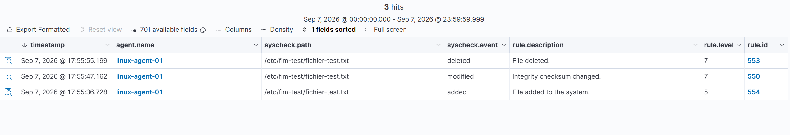
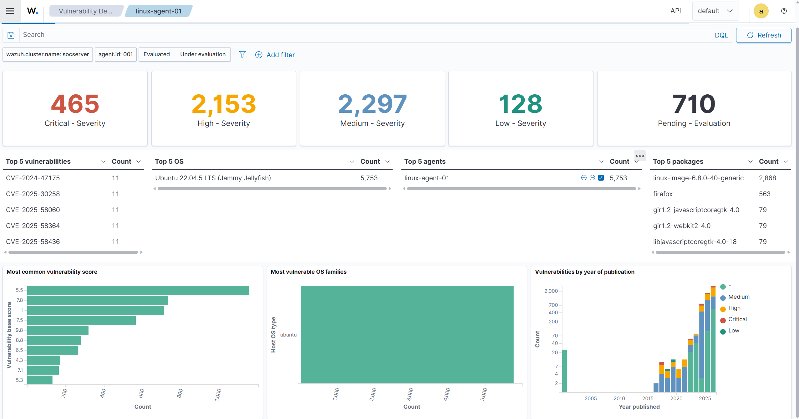
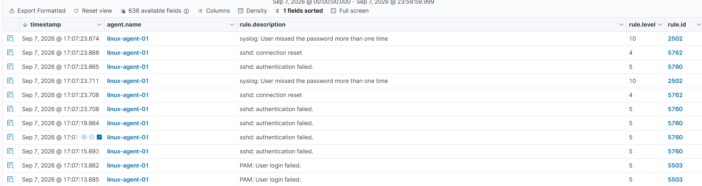

## Installation de Wazuh Manager 4.14

**Environnement** : VM Ubuntu 22.04.5 LTS, IP 192.168.56.10/24, réseau Host-Only.

**Étapes réalisées** :
- Provisionnement de la VM (VirtualBox, host-only)
- Installation du stack Wazuh 4.14 (Manager + Indexer + Dashboard) via le script d'installation officiel

## Problème : espace disque insuffisant lors de l'installation de Wazuh

**Symptôme** : l'installation du stack Wazuh (Manager + Indexer + Dashboard) 
a échoué en cours de décompression/installation, avec un message lié à un 
espace disque insuffisant.

**Diagnostic** : le `df -h` lancé juste après l'échec affichait 41% 
d'utilisation (14G disponibles sur 24G), ce qui semblait largement 
suffisant. L'explication la plus probable : l'installation (dpkg/apt) 
fonctionne de manière transactionnelle et a fait un rollback après 
l'échec, ce qui a libéré l'espace qui était temporairement occupé pendant 
la décompression du Dashboard et d'OpenSearch, deux composants volumineux. 
Le disque a donc probablement été saturé pendant quelques instants au 
moment de l'installation, sans que ça se voie une fois l'échec passé.

**Résolution** :
1. Redimensionnement du disque virtuel via VirtualBox
2. Extension du volume logique : `lvextend` + `resize2fs`
3. Relance de l'installation → succès

**Ce que j'en retiens** :
- Le stack Wazuh (OpenSearch en particulier) demande beaucoup d'espace 
  disque, même de façon temporaire pendant l'installation, mieux vaut 
  prévoir large dès le départ (50 Go recommandés).
- Un `df -h` lancé après coup peut induire en erreur si l'outil 
  d'installation fait un rollback automatique. Pour un vrai diagnostic, 
  il aurait fallu surveiller l'espace disque en direct pendant 
  l'installation (`watch -n 1 df -h`) ou regarder les logs d'installation.

**Résultat** : dashboard accessible, aucun agent connecté à ce stade (attendu).

## Problème configuration VM Windows 11

* **Contournement du compte Microsoft sur Windows 11 :** 
  * *Problème :* L'installateur de Windows 11 bloquait la configuration en exigeant obligatoirement une connexion Internet et un compte Microsoft en ligne.
  * *Résolution :* Déconnexion temporaire de la carte réseau virtuelle dans VirtualBox, utilisation de la commande `oobe\bypassnro` via le raccourci `Maj + F10`, puis sélection de l'option "Je n'ai pas Internet" pour forcer la création d'un compte local.

* **Navigation sur la nouvelle interface du Dashboard Wazuh (v4.14.7) :**
  * *Problème :* Les menus de configuration centralisée (pour la collecte de logs personnalisés) différaient des documentations standards, rendant l'édition du fichier `agent.conf` moins intuitive.
  * *Résolution :* Utilisation de l'onglet **Files** à l'intérieur du groupe `default` pour éditer et injecter directement les blocs de configuration XML pour Linux (`/var/log/auth.log`) et Windows (`Security`).

##  Vérification du module FIM (File Integrity Monitoring)

**Config appliquée** : ajout d'un dossier de test `/etc/fim-test` en 
surveillance temps réel (`realtime="yes"`) dans `ossec.conf`.

**Test réalisé** : création, modification, puis suppression d'un fichier 
dans ce dossier.

**Résultat** : les trois événements (added/modified/deleted) sont apparus 
dans le module "Integrity monitoring" du Dashboard, avec le chemin exact 
et l'horodatage.

**Ce que j'en retiens** : le mode realtime permet une détection quasi 
instantanée, contrairement au scan périodique par défaut (toutes les 
12h). C'est un point important si on veut détecter une modification de fichier 
critique rapidement (ex: /etc/passwd modifié par un attaquant).

---

##  Vérification du module Vulnerability Detection

**Config vérifiée** : module activé côté manager (`<enabled>yes</enabled>`).

**Résultat** : après synchronisation de la base CVE, un total de 4 953 
vulnérabilités évaluées a été détecté sur `linux-agent-01` (465 
Critical, 2 153 High, 2 297 Medium, 128 Low), plus 710 en attente 
d'évaluation. Les CVE les plus fréquentes concernent le noyau 
(`linux-image-6.8.0-40-generic`) et Firefox. Le système d'exploitation 
détecté est Ubuntu 22.04 LTS (Jammy Jellyfish).

**Ce que j'en retiens** : ce volume élevé de vulnérabilités s'explique 
par une image Ubuntu fraîchement installée, jamais mise à jour (`apt 
upgrade` non exécuté), ce qui illustre bien l'intérêt de ce module : 
sans lui, ces failles resteraient invisibles jusqu'à un audit ou un 
incident. Un vrai environnement de production appliquerait un cycle de 
patch management régulier pour maintenir ce chiffre bas.

## Vérification du module Log Collection

**Config vérifiée** : l'agent `linux-agent-01` collecte par défaut 
`/var/log/auth.log`, `/var/log/dpkg.log` et le log active-response.

**Test réalisé** : tentative de connexion SSH vers target-linux avec un 
mot de passe volontairement incorrect, répétée plusieurs fois.

**Résultat** : plusieurs alertes générées et visibles dans le Dashboard 
(Security events) :
- `sshd: authentication failed` (rule 5760, niveau 5)
- `sshd: connection reset` (rule 5762, niveau 4)
- `PAM: User login failed` (rule 5503, niveau 5)
- `syslog: User missed the password more than one time` (rule 2502, 
  niveau 10) — règle de corrélation qui se déclenche après plusieurs 
  échecs rapprochés, proche d'une détection de brute force

**Ce que j'en retiens** : Wazuh ne se contente pas de logger l'événement 
brut, il applique une couche de corrélation (plusieurs échecs → alerte de 
niveau plus élevé), ce qui est le principe même d'un SIEM par rapport à 
un simple collecteur de logs.

